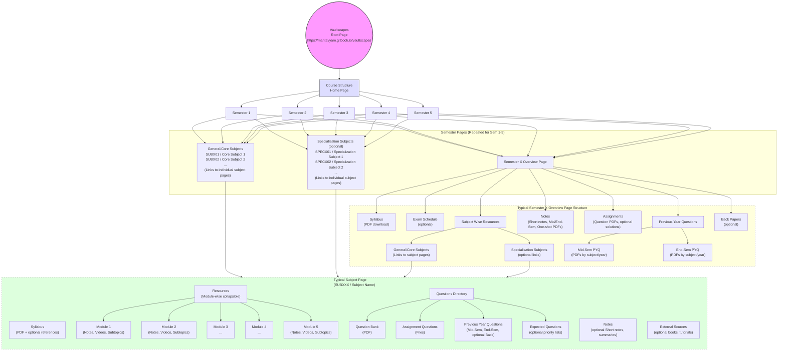

# IDEA
# Context
1. At this point The developer has initialised the starting point for a Flutter application with simple counter app prebuilt as boiler plate.
2. There is a dedicated folder in this project folder for reference and also a github repository which contains all actual content which needs to be presented as screens, the data is present in markdown files and is synced with gitbook to host content on the web. We shall utilise this content for creating our screens.
3. Content is distributed as represented in the Mermaid Diagram below , similarly for upto 8 semesters of a BTECH UG Course.


# Task
## General Idea of User Flow
- User Opens app for first time post installation
- App Opens with Screen displaying 2 Buttons 'Get Started' and 'Explore'
	- If Clicked on:
		- 'Get Started':
			- Bottom Sheet Opens with Buttons for the Auth flows 'Continue with Google'.
			- Auth Flow Completes
				- for new user only : Set Profile Data of Name as fetched from Provider ? or Customise Now! (We are only interested in User's Email Address which is fetched from provider and for name we shall have both saved in our database ; 1 from provider originally and 1 if set custom by user)
			- User is taken to the Home Screen
			- The Bottom Navigation Bar will have 4 icons for separation of concerns as described below:  
				- HOME 
				- ALPHASIGNAL.AI (WEBVIEW)
				- FEEDBACK+COLLABORATE
				- PROFILE 
		- 'Explore':
			- Auth Flow is skipped and User is directly taken to the Home Screen
			- PROFILE SECTION does not display user's credentials instead shows a 'Create Profile' or 'Login' buttons.

## Steps
I want you to create a strategy from a developer's POV to create a flutter application:
1. Define Product Overview & Objectives - Document the core value proposition, target users (students), and success metrics for the educational resource aggregation app.
2. Specify Functional Requirements - Detail the dual-path onboarding flow (Get Started vs Explore), authentication systems (Google), and the 4-section bottom navigation (Home, Alphasignal, Collaborate+Feedback, Profile).
3. Document Technical Architecture - Outline Flutter package requirements , project structure recommendations, and plug and play modular content management system for integration and future options for performing CRUD of new subject pages and it's contents under semester and new semester under the root.
4. Define User Experience Flows - Map complete user journeys from installation through semester preference settings, including guest mode functionality and profile customization workflows
5. Establish Development Phases & Acceptance Criteria - Break down implementation into Phase 1 (core webview functionality with mocked auth) and Phase 2 (real authentication), with specific deliverables and testing requirements

# Guidelines
- WEB URLs are provided in the '#CONTEXT' section for reference.
- Follow the 'App Flow' as described in '#TASK'
- Create functionality as deduced from requirements of 'GENERAL IDEA OF SCREENS' as instructed below and the Sitemap Mermaid architecture as demonstrated in the '#TASK'.
- Google OAuth Authentication is Implemented in real at the last stage when all features are built, until then mock auth flow with basic loading.
## GENERAL IDEA OF SCREENS
### HOME
**Generalized Root Home Page Structure**: It will have a root homepage with card links to take user to dedicated semester specific homepage.
```json
{
  "name": "Vaultscapes",
  "path": "https://mantavyam.gitbook.io/vaultscapes",
  "children": [
    {
      "name": "Course Structure",
      "path": "/",
      "children": [
        {
          "name": "Semester 1",
          "path": "/sem-1",
          "children": [
            {
              "name": "General Subjects",
              "children": [
                { "name": "SUBX01 / Core Subject 1" },
                { "name": "SUBX02 / Core Subject 2" },
                { "name": "SUBX03 / Core Subject 3" },
                { "name": "SUBX04 / Core Subject 4" }
              ]
            },
            {
              "name": "Specialisation",
              "path": "/sem-1/specialisation",
              "children": [
                { "name": "SPECX01 / Specialization Subject 1" },
                { "name": "SPECX02 / Specialization Subject 2" },
                { "name": "SPECX03 / Specialization Subject 3" },
                { "name": "SPECX04 / Specialization Subject 4" }
              ]
            }
          ]
        }
      ]
    }
  ]
}
```
**Generalized Individual Semester Home Page Structure**: 

```json
{
  "name": "Semester X Overview",
  "children": [
    {
      "name": "Syllabus",
      "children": [
        { "name": "Syllabus PDF (download)" }
      ]
    },
    {
      "name": "Exam Schedule (optional)",
      "description": "Often empty or with links"
    },
    {
      "name": "Subject Wise Resources",
      "children": [
        {
          "name": "General/Core Subjects",
          "children": [
            { "name": "SUBX01 / Core Subject 1 (link)" },
            { "name": "SUBX02 / Core Subject 2 (link)" },
            { "name": "SUBX03 / Core Subject 3 (link)" },
            { "name": "SUBX04 / Core Subject 4 (link)" },
            { "name": "SUBX05 / Core Subject 5 (link)" },
            { "name": "SUBX06 / Core Subject 6 (link)" }
          ]
        },
        {
          "name": "Specialisation Subjects (optional)",
          "children": [
            { "name": "SPECX01 / Specialization Subject 1 (link)" },
            { "name": "SPECX02 / Specialization Subject 2 (link)" },
            { "name": "SPECX03 / Specialization Subject 3 (link)" },
            { "name": "SPECX04 / Specialization Subject 4 (link)" }
          ]
        }
      ]
    },
    {
      "name": "Notes",
      "description": "Semester-level or subject-wise note PDFs",
      "children": [
        { "name": "Short Notes / Key Notes PDFs (various subjects)" },
        { "name": "Mid-Sem / End-Sem Notes PDFs" },
        { "name": "One-shot / Viva Notes PDFs" }
      ]
    },
    {
      "name": "Assignments",
      "children": [
        { "name": "Assignment Questions PDFs (various subjects)" },
        { "name": "Assignment Responses/Solutions (optional)" }
      ]
    },
    {
      "name": "Previous Year Questions",
      "children": [
        {
          "name": "Mid-Sem PYQ",
          "children": [
            { "name": "Mid-Sem Question PDFs (by subject and year)" }
          ]
        },
        {
          "name": "End-Sem PYQ",
          "children": [
            { "name": "End-Sem Question PDFs (by subject and year)" }
          ]
        }
      ]
    },
    {
      "name": "Back Papers (optional)",
      "children": [
        { "name": "Back Assignments PDFs" },
        { "name": "Back Question Papers PDFs" }
      ]
    }
  ]
}
```
**Generalized Individual Subject Page Structure**: 

```json
{
  "name": "SUBXXX / Subject Name",
  "children": [
    {
      "name": "Syllabus",
      "children": [
        { "name": "Syllabus PDF (downloadable PDF)" },
        { "name": "Reference links/books (optional)" }
      ]
    },
    {
      "name": "Resources",
      "description": "Module-wise collapsible sections",
      "children": [
        {
          "name": "Module 1: Module Name/Topic",
          "children": [
            { "name": "Lecture Notes/Downloads" },
            { "name": "YouTube/Video Links" },
            { "name": "Subtopics (details)" }
          ]
        },
        {
          "name": "Module 2: Module Name/Topic",
          "children": [
            { "name": "Lecture Notes/Downloads" },
            { "name": "YouTube/Video Links" },
            { "name": "Subtopics (details)" }
          ]
        },
        {
          "name": "Module 3: Module Name/Topic",
          "children": [
            { "name": "Lecture Notes/Downloads" },
            { "name": "YouTube/Video Links" },
            { "name": "Subtopics (details)" }
          ]
        },
        {
          "name": "Module 4: Module Name/Topic",
          "children": [
            { "name": "Lecture Notes/Downloads" },
            { "name": "YouTube/Video Links" },
            { "name": "Subtopics (details)" }
          ]
        },
        {
          "name": "Module 5: Module Name/Topic",
          "children": [
            { "name": "Lecture Notes/Downloads" },
            { "name": "YouTube/Video Links" },
            { "name": "Subtopics (details)" }
          ]
        }
      ]
    },
    {
      "name": "Notes",
      "children": [
        { "name": "Short Notes PDFs" },
        { "name": "Summaries/One-pagers" }
      ]
    },
    {
      "name": "Questions Directory",
      "children": [
        { "name": "Question Bank (PDF/download)" },
        {
          "name": "Assignment Questions",
          "children": [
            { "name": "Assignment files" }
          ]
        },
        {
          "name": "Previous Year Questions (PYQs)",
          "children": [
            { "name": "Mid-Sem PYQs" },
            { "name": "End-Sem PYQs" },
            { "name": "Back Papers (optional)" }
          ]
        },
        {
          "name": "Expected Questions (optional)",
          "children": [
            { "name": "Priority lists/files" }
          ]
        }
      ]
    },
    {
      "name": "External Sources (optional)",
      "children": [
        { "name": "Book links/PDFs" },
        { "name": "Tutorial websites" }
      ]
    }
  ]
}
```
### ALPHASIGNAL
- Display Webview of the URL 'https://alphasignal.ai/last-email' as an individual dedicated screen, display loading indicator until the content is fetched fully, here the user will only scroll the page and the web content shall load dynamically.
### FEEDBACK & COLLABORATE
#### FRAGMENT 1: PROVIDE FEEDBACK
```
# Feedback Form | Vaultscapes

Vaultscapes is an Open-Source Academic Resource Database.

Hi, I’m_____________

Enter Your Name:

Email ID

Email will only be used to respond to your feedback! We respect your privacy.

Select Your Role

(Respondents can select up to 1)

Student
Faculty
Alumni
Staff
Others

How often do you use Vaultscapes?

(Respondents can select as many as they like)
Daily
Weekly
Once in a Month
Exam Time Only
Amateur New User

Which semester are you providing feedback about?

(Respondents can select up to 1)

Semester 1 / BTECH
Semester 2 / BTECH
Semester 3 / BTECH
Semester 4 / BTECH
Semester 5 / BTECH
Semester 6 / BTECH
Semester 7 / BTECH
Semester 8 / BTECH

What type of feedback are you providing?

(Respondents can select up to 1)

- Grievance (eg Broken/Incorrect Links or Missing/Incorrect Resource)
- Improvement Suggestion (eg Additional Resources r New Feature Ideas)
- General Feedback (eg User feedback or overall satisfaction)
- Technical Issues (eg Navigation Issues or Unresponsiveness)

Please describe your feedback in detail

Provide as much detail as possible about the issue, suggestion, or comment.

Enter the Link to the Page:

Copy and Paste the URL of Web-Page you’re having issues with.

Attach Files & media (Optional)

Screen Shots/Recordings will help us identify the issue faster.

How would you Rate the overall usability of Vaultscapes?

(Optional)

(Respondents can select as many as they like where 5 being very easy and 1 being very hard)

- 5
- 4
- 3
- 2
- 1 
```

#### FRAGMENT 2: COLLABORATE NOW
```
# Collaborate on Vaultscapes

What are you submitting?
(Respondents can select as many as they like)
Notes
Assignment
Lab Manual (Expt)
Question Bank
Exam Papers (PYQ)
Code Examples
External Link / Sources

What is the source of your submission?
Self Written
Internet Document/Resource
Faculty Provided Material
AI-Assisted Human-guided Content

For which semester are you submitting this resource?
(Respondents can select up to 1)
Semester 1 / BTECH
Semester 2 / BTECH
Semester 3 / BTECH
Semester 4 / BTECH
Semester 5 / BTECH
Semester 6 / BTECH
Semester 7 / BTECH
Semester 8 / BTECH


What is the subject name and code?

(E.g., Computer Science - CS101)

Attach (Field 1): Please attach your files here

You can upload 10 files at a time with a size Limit of 5 mb

Attach (Field 2): Optional for URL Submission

Describe your submission.

(A Short explanation of what this resource contains or why it’s useful.)

Would you like to be credited for this submission on Vaultscapes?
[YES] [NO]

If yes, please provide the name or details you'd like to be credited with.

(E.g., Full Name, Email, Social Media Handle, or "Anonymous")

Optional Notes for Admins

Any additional notes or information you’d like to share with us?
```
### PROFILE
Will have Very Basic functionality to customise User Profile: 
- Edit Name (Only)
- Profile Picture and Email Address (Synced from Provider, Non Editable)

Feature for Overriding the HOMEPAGE: By default it opens the HOMEPAGE where user shall navigate to respective semester, instead provide a option for setting custom preference of semester to directly open the respective semester homepage instead of root homepage to save time spend in navigation and sync this preference with database to save user's settings.

Section of Buttons of Other Links below Profile Card to be opened within App:
- OPEN SEARCH (Alongside Trigger keyboard Opening also exclusive for this) = 'https://mantavyam.gitbook.io/vaultscapes?q='
- GITHUB = 'https://github.com/mantavyam/vaultscapesDB'
- DISCORD = 'https://discord.com/invite/AQ7PNzdCnC'
- HOW TO USE DATABASE? = 'https://mantavyam.gitbook.io/vaultscapes/how-to-use-database'
- HOW TO COLLABORATE? = 'https://mantavyam.gitbook.io/vaultscapes/how-to-collaborate'
- COLLABORATORS = 'https://mantavyam.gitbook.io/vaultscapes/collaborators'  
- PRIVACY POLICY = https://mantavyam.gitbook.io/vaultscapes/privacy-policy
- TERMS OF SERVICE = https://mantavyam.gitbook.io/vaultscapes/terms-of-service
# Constraints
- Do not provide Code at this point, only create a PRD.
- We don't want to use the Material or Cupertino instead we shall use a pub.dev package based on shadcn styling ubiquitous in web standard and actually very beautiful available at 'https://pub.dev/packages/shadcn_flutter' with version shadcn_flutter: ^0.0.47 and documentation for installation at 'https://sunarya-thito.github.io/shadcn_flutter/#/installation'
	- You shall also perform a planning for building the UI screens and components layout with the shadcn_flutter pub.dev package, I've attached the available components in a attachment 'shadcn_flutter.md'
- Remember we are targetting to build the simplest user experience without overwhelming the user.

# Product Requirements Document (PRD)
## Vaultscapes Mobile Application

---

## 1. Product Overview & Objectives

### 1.1 Product Vision
Vaultscapes is a mobile-first educational resource aggregation platform designed to provide BTech students with seamless access to semester-wise academic materials, including notes, assignments, previous year questions, and curated learning resources.

### 1.2 Core Value Proposition
- **Centralized Access**: Single platform for all academic resources across 8 semesters
- **Structured Navigation**: Hierarchical organization (Semester → Subject → Module → Resources)
- **Flexible Onboarding**: Guest exploration or authenticated personalized experience
- **Community-Driven**: Built-in feedback and collaboration mechanisms

### 1.3 Target Users
- **Primary**: BTech undergraduate students (Semesters 1-8)
- **Secondary**: Faculty, alumni, and academic staff
- **Tertiary**: Prospective students exploring course structure

### 1.4 Success Metrics
- User engagement (daily/weekly active users)
- Resource download/view counts
- Feedback submission rate
- Collaboration contributions per semester
- Guest-to-authenticated user conversion rate
- Average session duration
- Homepage preference adoption rate

---

## 2. Functional Requirements

### 2.1 Onboarding & Authentication

#### 2.1.1 Initial Launch Screen
**Components:**
- Hero section with Vaultscapes branding
- Two primary CTAs:
  - **"Get Started"** (Primary button)
  - **"Explore"** (Secondary/Ghost button)

**User Flows:**

**Flow A: "Get Started" Path**
1. User taps "Get Started"
2. Bottom sheet slides up with authentication options
3. **Phase 1 (MVP)**: Mock authentication with loading indicator (2-3 seconds)
4. **Phase 2**: "Continue with Google" OAuth integration
5. Post-authentication:
   - **New Users**: Optional profile customization screen
     - Display name fetched from provider (editable)
     - Skip option available
   - **Returning Users**: Direct navigation to Home
6. Navigate to Bottom Navigation interface

**Flow B: "Explore" Path**
1. User taps "Explore"
2. Immediate navigation to Bottom Navigation interface (Guest Mode)
3. Limited Profile functionality (prompts for authentication)

#### 2.1.2 Authentication Data Model
```
User {
  uid: String (unique identifier)
  email: String (from provider, non-editable)
  displayName: String (from provider, initial value)
  customName: String (optional, user-editable)
  profilePictureUrl: String (from provider)
  homepagePreference: String (default: 'root', options: 'root', 'sem-1' through 'sem-8')
  createdAt: DateTime
  lastLoginAt: DateTime
  isGuest: Boolean
}
```

### 2.2 Bottom Navigation Architecture

#### 2.2.1 Navigation Structure
Four-tab bottom navigation bar (persistent across authenticated/guest modes):

1. **HOME** (Icon: Home/Dashboard)
2. **ALPHASIGNAL.AI** (Icon: Brain/AI)
3. **FEEDBACK + COLLABORATE** (Icon: MessageSquare/Handshake)
4. **PROFILE** (Icon: User/Account)

#### 2.2.2 Navigation Behavior
- Active tab highlighted with accent color
- Tab switching preserves scroll position within each section
- Deep linking support for direct navigation to specific semesters/subjects

---

### 2.3 HOME Section

#### 2.3.1 Root Homepage (Default View)
**Layout:**
- App Bar with Vaultscapes branding and search icon
- Greeting based on time of day (authenticated users) or generic welcome (guests)
- Grid/List of semester cards (Semester 1 through Semester 8)

**Semester Card Components (shadcn_flutter):**
- `Card` widget with `CardImage` for semester thumbnail
- `CardTitle`: "Semester X"
- `CardDescription`: Brief summary (e.g., "Foundational Courses")
- Navigation arrow/chevron icon
- Tap interaction navigates to Semester Overview Page

#### 2.3.2 Semester Overview Page
**Structure:**
- `AppBar` with back button, semester title, and share icon
- Collapsible sections using `Accordion` or `Collapsible` components:

**Section 1: Syllabus**
- Download button for semester syllabus PDF
- Uses `Button` with download icon

**Section 2: Exam Schedule (Optional)**
- Conditional rendering if data exists
- Display as `Timeline` or `Table` component

**Section 3: Subject Wise Resources**
- Two subsections using nested `Accordion`:
  - **General/Core Subjects**: List of 6 core subjects
  - **Specialisation Subjects**: List of 4 specialization subjects (if applicable)
- Each subject as a tappable `Card` or list item navigating to Subject Page

**Section 4: Notes**
- `Chip` tags for note categories (Short Notes, Mid-Sem, End-Sem, One-shot)
- Download links using `Button` with file type icons

**Section 5: Assignments**
- List of assignment PDFs with download functionality
- Optional solutions displayed with `Badge` ("Solution Available")

**Section 6: Previous Year Questions**
- Nested `Tabs` for Mid-Sem PYQ and End-Sem PYQ
- Filterable by subject and year using `Select` dropdowns
- Download buttons for each PDF

**Section 7: Back Papers (Optional)**
- Similar structure to PYQs

#### 2.3.3 Subject Page
**Layout:**
- `AppBar` with subject code and name
- `TabList` with the following tabs:

**Tab 1: Syllabus**
- Syllabus PDF download button
- Reference links as external link buttons

**Tab 2: Resources**
- `Accordion` for 5 modules:
  - Module header shows module number and topic
  - Expanded view shows:
    - Lecture notes download links
    - YouTube video embeds/links (open in-app or external)
    - Subtopic list with `Chip` tags

**Tab 3: Notes**
- Categorized note downloads (Short Notes, Summaries)

**Tab 4: Questions Directory**
- Nested structure:
  - Question Bank download
  - Assignments (collapsible list)
  - PYQs (Mid-Sem, End-Sem, Back Papers)
  - Expected Questions (optional)

**Tab 5: External Sources (Optional)**
- Book links and tutorial website buttons

#### 2.3.4 Homepage Preference Override
**Implementation:**
- Setting stored in `User.homepagePreference`
- Available in Profile section
- Uses `Select` dropdown with options:
  - "Root Homepage (Default)"
  - "Semester 1" through "Semester 8"
- On app launch, check preference:
  ```
  if (user.isAuthenticated && user.homepagePreference != 'root') {
    navigateToSemester(user.homepagePreference)
  } else {
    navigateToRootHomepage()
  }
  ```

---

### 2.4 ALPHASIGNAL.AI Section

#### 2.4.1 WebView Implementation
**Requirements:**
- Full-screen WebView displaying `https://alphasignal.ai/last-email`
- Loading indicator using `CircularProgress` or `LinearProgress` until content loads
- Pull-to-refresh functionality using `RefreshTrigger`
- Browser controls:
  - Refresh button in AppBar
  - Share button to share URL
  - "Open in Browser" option in overflow menu (`DropdownMenu`)

#### 2.4.2 Error Handling
- Network error state with retry button
- Timeout handling (15 seconds)
- Fallback message with support contact

---

### 2.5 FEEDBACK + COLLABORATE Section

#### 2.5.1 Layout Structure
**Two-tab interface using `TabList`:**
- Tab 1: PROVIDE FEEDBACK
- Tab 2: COLLABORATE NOW

#### 2.5.2 Tab 1: PROVIDE FEEDBACK Form

**Form Fields (using shadcn_flutter components):**

1. **Header Section**
   - Title using styled typography
   - Subtitle explaining Vaultscapes mission

2. **Name Input**
   - `TextInput` with placeholder "Enter Your Name"
   - Label: "Hi, I'm_____________"

3. **Email Input**
   - `TextInput` with email validation
   - Helper text: "Email will only be used to respond to your feedback! We respect your privacy."
   - Auto-populate if authenticated

4. **Role Selection**
   - `RadioGroup` or `Select` (single choice):
     - Student
     - Faculty
     - Alumni
     - Staff
     - Others

5. **Usage Frequency**
   - `CheckboxGroup` (multiple selection allowed):
     - Daily
     - Weekly
     - Once in a Month
     - Exam Time Only
     - Amateur New User

6. **Semester Selection**
   - `Select` dropdown (single choice):
     - Semester 1 / BTECH through Semester 8 / BTECH

7. **Feedback Type**
   - `RadioCard` or `RadioGroup` (single choice):
     - Grievance (eg Broken/Incorrect Links or Missing/Incorrect Resource)
     - Improvement Suggestion (eg Additional Resources or New Feature Ideas)
     - General Feedback (eg User feedback or overall satisfaction)
     - Technical Issues (eg Navigation Issues or Unresponsiveness)

8. **Detailed Description**
   - `TextArea` (multiline)
   - Label: "Please describe your feedback in detail"
   - Helper text: "Provide as much detail as possible about the issue, suggestion, or comment."

9. **Page URL**
   - `TextInput` with URL validation
   - Label: "Enter the Link to the Page"
   - Helper text: "Copy and Paste the URL of Web-Page you're having issues with."

10. **File Attachments**
    - File picker button (screenshots/recordings)
    - Label: "Attach Files & media (Optional)"
    - Helper text: "Screen Shots/Recordings will help us identify the issue faster."
    - Maximum 5 files, 10MB total

11. **Usability Rating (Optional)**
    - `StarRating` component (1-5 stars)
    - Label: "How would you Rate the overall usability of Vaultscapes?"

12. **Submit Button**
    - Primary `Button` with loading state
    - Success `Toast` notification on submission
    - `AlertDialog` for confirmation

#### 2.5.3 Tab 2: COLLABORATE NOW Form

**Form Fields:**

1. **Submission Type**
   - `CheckboxGroup` (multiple selection):
     - Notes
     - Assignment
     - Lab Manual (Expt)
     - Question Bank
     - Exam Papers (PYQ)
     - Code Examples
     - External Link / Sources

2. **Source Selection**
   - `RadioGroup`:
     - Self Written
     - Internet Document/Resource
     - Faculty Provided Material
     - AI-Assisted Human-guided Content

3. **Semester Selection**
   - `Select` dropdown (single choice):
     - Semester 1 / BTECH through Semester 8 / BTECH

4. **Subject Details**
   - `TextInput` with autocomplete suggestions
   - Label: "What is the subject name and code?"
   - Placeholder: "E.g., Computer Science - CS101"

5. **File Upload (Field 1)**
   - File picker with drag-and-drop
   - Label: "Attach (Field 1): Please attach your files here"
   - Constraints: 10 files max, 5MB per file

6. **URL Submission (Field 2)**
   - `TextInput` with URL validation (optional)
   - Label: "Attach (Field 2): Optional for URL Submission"

7. **Description**
   - `TextArea`
   - Label: "Describe your submission"
   - Helper text: "A Short explanation of what this resource contains or why it's useful."

8. **Credit Preference**
   - `RadioGroup`:
     - YES (show name input field)
     - NO (anonymous submission)
   - Conditional `TextInput` for credit details if YES selected

9. **Admin Notes (Optional)**
   - `TextArea`
   - Label: "Optional Notes for Admins"

10. **Submit Button**
    - Primary `Button` with loading state
    - Success `Toast` notification
    - `AlertDialog` for confirmation

---

### 2.6 PROFILE Section

#### 2.6.1 Authenticated User View

**Profile Card (using `Card` component):**
- Profile picture (circular `Avatar` from provider)
- Email address (read-only, from provider)
- Display name with edit icon
  - Tap to open `Dialog` with `TextInput` for name editing
  - Save/Cancel buttons

**Settings Section:**

**Homepage Preference**
- `Card` with title "Default Homepage"
- `Select` dropdown:
  - Options: "Root Homepage", "Semester 1" through "Semester 8"
  - Helper text: "Skip navigation by setting your default semester"
- Auto-save on selection change with `Toast` confirmation

**Quick Links Section (`Card` with list items):**
Each link opens in WebView or external browser:

1. **Open Search**
   - Opens: `https://mantavyam.gitbook.io/vaultscapes?q=`
   - Triggers keyboard with search input overlay
   - Icon: Search/Magnifying glass

2. **GitHub**
   - URL: `https://github.com/mantavyam/vaultscapesDB`
   - Icon: GitHub logo

3. **Discord**
   - URL: `https://discord.com/invite/AQ7PNzdCnC`
   - Icon: Discord logo

4. **How to Use Database?**
   - URL: `https://mantavyam.gitbook.io/vaultscapes/how-to-use-database`
   - Icon: Help Circle

5. **How to Collaborate?**
   - URL: `https://mantavyam.gitbook.io/vaultscapes/how-to-collaborate`
   - Icon: Users/Group

6. **Collaborators**
   - URL: `https://mantavyam.gitbook.io/vaultscapes/collaborators`
   - Icon: Award/Star

7. **Privacy Policy**
   - URL: `https://mantavyam.gitbook.io/vaultscapes/privacy-policy`
   - Icon: Shield

8. **Terms of Service**
   - URL: `https://mantavyam.gitbook.io/vaultscapes/terms-of-service`
   - Icon: File Text

**Logout Button:**
- Destructive `Button` at bottom
- `AlertDialog` confirmation before logout

#### 2.6.2 Guest User View
**Components:**
- Generic avatar placeholder
- Text: "You're browsing as a guest"
- Primary `Button`: "Create Profile / Login"
  - Opens authentication bottom sheet (same as "Get Started" flow)

**Quick Links Section:**
- Same as authenticated view (links don't require authentication)

---

## 3. Technical Architecture

### 3.1 Technology Stack

#### 3.1.1 Core Framework
- **Flutter SDK**: Latest stable version (3.x+)
- **Dart**: 3.0+

#### 3.1.2 UI Framework
- **shadcn_flutter**: `^0.0.47`
  - Replaces Material/Cupertino entirely
  - Installation: `https://sunarya-thito.github.io/shadcn_flutter/#/installation`

#### 3.1.3 Required Packages

**Authentication (Phase 2):**
- `google_sign_in`: Latest version
- `firebase_auth`: Latest version (if using Firebase)
- OR `supabase_flutter`: Latest version (alternative backend)

**State Management:**
- `provider`: ^6.0.0 OR
- `riverpod`: ^2.0.0 (recommended for scalability)

**Navigation:**
- `go_router`: ^14.0.0 (declarative routing with deep linking support)

**WebView:**
- `webview_flutter`: ^4.0.0
- `flutter_inappwebview`: ^6.0.0 (alternative with more features)

**HTTP & API:**
- `http`: ^1.1.0 (fetching markdown from GitBook URLs)
- `dio`: ^5.0.0 (optional, for advanced features like retry logic)

**Markdown Rendering:**
- `flutter_markdown`: ^0.6.18 (primary markdown rendering engine)
- `markdown`: ^7.1.1 (markdown parsing for custom block builders)

**Local Storage & Caching:**
- `shared_preferences`: ^2.0.0 (user preferences)
- `hive`: ^2.2.3 (markdown content caching with timestamp tracking)
- `hive_flutter`: ^1.1.0 (Flutter integration for Hive)
- `path_provider`: ^2.0.0 (local file paths)

**File Handling:**
- `file_picker`: ^6.0.0 (for feedback/collaboration forms)
- `open_filex`: ^4.0.0 (open downloaded PDFs)

**PDF Viewing (Optional for Phase 2):**
- `flutter_pdfview`: ^1.3.0 OR
- `syncfusion_flutter_pdfviewer`: ^24.0.0

**URL Launching:**
- `url_launcher`: ^6.0.0 (open PDF links, external resources)

**Utilities:**
- `intl`: ^0.18.0 (date/time formatting)
- `connectivity_plus`: ^5.0.0 (network status monitoring)
- `cached_network_image`: ^3.0.0 (image caching for markdown images)

### 3.2 Project Structure

```
lib/
├── main.dart
├── app.dart
├── core/
│   ├── constants/
│   │   ├── app_constants.dart
│   │   ├── route_constants.dart
│   │   └── url_constants.dart (GitBook base URLs)
│   ├── theme/
│   │   ├── app_theme.dart
│   │   └── color_scheme.dart
│   ├── utils/
│   │   ├── validators.dart
│   │   ├── helpers.dart
│   │   ├── extensions.dart
│   │   └── markdown_helpers.dart (markdown parsing utilities)
│   └── error/
│       ├── exceptions.dart
│       └── failures.dart
├── data/
│   ├── models/
│   │   ├── user_model.dart
│   │   ├── navigation_model.dart (navigation manifest)
│   │   ├── semester_model.dart
│   │   ├── subject_model.dart
│   │   ├── cached_markdown_model.dart (markdown + timestamp)
│   │   ├── feedback_model.dart
│   │   └── collaboration_model.dart
│   ├── repositories/
│   │   ├── auth_repository.dart
│   │   ├── markdown_repository.dart (fetch & cache markdown)
│   │   ├── navigation_repository.dart (load navigation manifest)
│   │   ├── user_preferences_repository.dart
│   │   ├── feedback_repository.dart
│   │   └── collaboration_repository.dart
│   ├── services/
│   │   ├── markdown_fetcher_service.dart (HTTP fetching)
│   │   ├── markdown_cache_service.dart (Hive caching)
│   │   ├── local_storage_service.dart
│   │   └── analytics_service.dart
│   └── parsers/
│       ├── gitbook_markdown_parser.dart (custom GitBook block parser)
│       ├── hint_block_parser.dart
│       ├── tabs_block_parser.dart
│       ├── expandable_block_parser.dart
│       └── card_block_parser.dart
├── domain/
│   ├── entities/
│   │   ├── user.dart
│   │   ├── semester.dart
│   │   ├── subject.dart
│   │   ├── markdown_content.dart
│   │   └── navigation_item.dart
│   └── usecases/
│       ├── authenticate_user.dart
│       ├── get_markdown_content.dart
│       ├── refresh_markdown_cache.dart
│       ├── load_navigation_structure.dart
│       ├── submit_feedback.dart
│       └── submit_collaboration.dart
├── presentation/
│   ├── providers/
│   │   ├── auth_provider.dart
│   │   ├── markdown_provider.dart (manages markdown state)
│   │   ├── navigation_provider.dart
│   │   └── cache_provider.dart
│   ├── screens/
│   │   ├── onboarding/
│   │   │   ├── welcome_screen.dart
│   │   │   └── profile_setup_screen.dart
│   │   ├── home/
│   │   │   ├── root_homepage_screen.dart
│   │   │   ├── semester_overview_screen.dart (renders markdown)
│   │   │   └── subject_detail_screen.dart (renders markdown)
│   │   ├── alphasignal/
│   │   │   └── alphasignal_webview_screen.dart
│   │   ├── feedback_collaborate/
│   │   │   ├── feedback_collaborate_screen.dart
│   │   │   ├── feedback_form_tab.dart
│   │   │   └── collaborate_form_tab.dart
│   │   ├── profile/
│   │   │   ├── profile_screen.dart
│   │   │   └── edit_profile_dialog.dart
│   │   └── main_navigation_screen.dart
│   ├── widgets/
│   │   ├── common/
│   │   │   ├── loading_indicator.dart
│   │   │   ├── error_widget.dart
│   │   │   └── empty_state_widget.dart
│   │   ├── cards/
│   │   │   ├── semester_card.dart
│   │   │   ├── subject_card.dart
│   │   │   └── resource_card.dart
│   │   ├── markdown/
│   │   │   ├── markdown_renderer.dart (custom renderer)
│   │   │   ├── hint_block_widget.dart (renders hints as Alerts)
│   │   │   ├── tabs_block_widget.dart (renders tabs as TabList)
│   │   │   ├── expandable_block_widget.dart (renders as Accordion)
│   │   │   ├── card_block_widget.dart (renders GitBook cards)
│   │   │   └── pdf_link_widget.dart (download button for PDFs)
│   │   ├── forms/
│   │   │   ├── custom_text_input.dart
│   │   │   ├── custom_dropdown.dart
│   │   │   └── file_picker_widget.dart
│   │   └── navigation/
│   │       └── custom_bottom_nav_bar.dart
│   └── routes/
│       └── app_router.dart
└── config/
    └── environment_config.dart
```

**New Asset Structure:**
```
assets/
├── data/
│   └── navigation.json (lightweight navigation manifest)
├── images/
│   ├── logo.png
│   ├── semester_thumbnails/
│   │   ├── sem_1.png
│   │   └── ...
│   └── placeholders/
└── fonts/ (if using custom fonts)
```

### 3.3 Data Architecture

#### 3.3.1 Content Management System (Modified Hybrid Approach)

**Navigation Manifest (Local Asset)**

The navigation manifest is a lightweight JSON file bundled with the app that contains:
- Semester structure and metadata
- Subject lists with codes and names
- **Markdown URLs** pointing to GitBook `.md` files
- Resource categorization hints

**Structure: `assets/data/navigation.json`**
```json
{
  "version": "1.0.0",
  "lastUpdated": "2026-01-17T00:00:00Z",
  "baseUrl": "https://mantavyam.gitbook.io/vaultscapes",
  "semesters": [
    {
      "id": "sem-1",
      "title": "Semester 1",
      "description": "Foundational Courses",
      "thumbnailUrl": "assets/images/semester_thumbnails/sem_1.png",
      "overviewMarkdownUrl": "https://mantavyam.gitbook.io/vaultscapes/semester-1.md",
      "syllabusUrl": "https://example.com/sem1-syllabus.pdf",
      "coreSubjects": [
        {
          "id": "cs101",
          "code": "CS101",
          "name": "Introduction to Programming",
          "markdownUrl": "https://mantavyam.gitbook.io/vaultscapes/sem-1/cs101.md"
        },
        {
          "id": "math101",
          "code": "MATH101",
          "name": "Calculus I",
          "markdownUrl": "https://mantavyam.gitbook.io/vaultscapes/sem-1/math101.md"
        }
      ],
      "specializationSubjects": [
        {
          "id": "ai101",
          "code": "AI101",
          "name": "AI Fundamentals",
          "markdownUrl": "https://mantavyam.gitbook.io/vaultscapes/sem-1/specialization/ai101.md"
        }
      ]
    },
    {
      "id": "sem-2",
      "title": "Semester 2",
      "description": "Core Engineering Concepts",
      "thumbnailUrl": "assets/images/semester_thumbnails/sem_2.png",
      "overviewMarkdownUrl": "https://mantavyam.gitbook.io/vaultscapes/semester-2.md",
      "coreSubjects": [],
      "specializationSubjects": []
    }
    // ... semesters 3-8
  ]
}
```

**Benefits of This Structure:**
- Small file size (~10-50 KB for 8 semesters)
- Easy to update via app release or dynamic download
- Provides instant navigation structure
- Markdown content fetched on-demand

---

#### 3.3.2 Markdown Fetching & Caching Strategy

**Workflow:**
1. **App Launch**: Load `navigation.json` from assets
2. **User Navigates to Page**: Check cache for markdown
3. **Cache Hit (< 24 hours old)**: Serve from cache immediately
4. **Cache Miss/Stale**: 
   - Show loading indicator
   - Fetch markdown from GitBook URL
   - Parse and render
   - Cache with timestamp
5. **Pull-to-Refresh**: Force re-fetch and update cache

**Cache Data Model:**
```dart
class CachedMarkdown {
  final String url;
  final String content;
  final DateTime timestamp;
  final String etag; // Optional: for HTTP caching headers
  
  bool get isStale {
    final age = DateTime.now().difference(timestamp);
    return age.inHours > 24; // 24-hour TTL
  }
}
```

**Hive Cache Implementation:**
```dart
class MarkdownCacheService {
  static const String boxName = 'markdown_cache';
  late Box<CachedMarkdown> _box;
  
  Future<void> init() async {
    await Hive.initFlutter();
    Hive.registerAdapter(CachedMarkdownAdapter());
    _box = await Hive.openBox<CachedMarkdown>(boxName);
  }
  
  Future<CachedMarkdown?> get(String url) async {
    return _box.get(url);
  }
  
  Future<void> set(String url, String content) async {
    final cached = CachedMarkdown(
      url: url,
      content: content,
      timestamp: DateTime.now(),
    );
    await _box.put(url, cached);
  }
  
  Future<void> clear() async {
    await _box.clear();
  }
  
  Future<void> delete(String url) async {
    await _box.delete(url);
  }
}
```

---

#### 3.3.3 Markdown Repository Pattern

**MarkdownRepository:**
```dart
class MarkdownRepository {
  final MarkdownFetcherService _fetcher;
  final MarkdownCacheService _cache;
  final ConnectivityService _connectivity;
  
  MarkdownRepository(this._fetcher, this._cache, this._connectivity);
  
  /// Get markdown content with smart caching
  Future<String> getMarkdown(String url, {bool forceRefresh = false}) async {
    // Check cache first (unless force refresh)
    if (!forceRefresh) {
      final cached = await _cache.get(url);
      if (cached != null && !cached.isStale) {
        return cached.content;
      }
    }
    
    // Check network connectivity
    if (!await _connectivity.isConnected) {
      // Return stale cache if available, else throw error
      final cached = await _cache.get(url);
      if (cached != null) {
        return cached.content; // Stale but better than nothing
      }
      throw NetworkException('No internet connection');
    }
    
    // Fetch from network
    try {
      final content = await _fetcher.fetch(url);
      
      // Update cache
      await _cache.set(url, content);
      
      return content;
    } catch (e) {
      // Network error - try to return cached version
      final cached = await _cache.get(url);
      if (cached != null) {
        return cached.content;
      }
      rethrow;
    }
  }
  
  /// Clear all cached markdown
  Future<void> clearCache() async {
    await _cache.clear();
  }
  
  /// Refresh specific page
  Future<String> refreshMarkdown(String url) async {
    return getMarkdown(url, forceRefresh: true);
  }
}
```

**MarkdownFetcherService:**
```dart
class MarkdownFetcherService {
  final http.Client _client;
  
  MarkdownFetcherService(this._client);
  
  Future<String> fetch(String url) async {
    try {
      final response = await _client.get(
        Uri.parse(url),
        headers: {'Accept': 'text/markdown'},
      ).timeout(Duration(seconds: 15));
      
      if (response.statusCode == 200) {
        return response.body;
      } else {
        throw FetchException(
          'Failed to fetch markdown: ${response.statusCode}',
        );
      }
    } on TimeoutException {
      throw FetchException('Request timed out');
    } on http.ClientException {
      throw NetworkException('Network error');
    }
  }
}
```

---

#### 3.3.4 GitBook Markdown Parsing Strategy

**Custom Markdown Builders for GitBook Blocks:**

GitBook uses custom markdown extensions. We'll parse these and map them to shadcn_flutter components.

**Supported GitBook Blocks (Phase 1):**
- ✅ **Hints**: Map to `Alert` component (info/warning/success variants)
- ✅ **Expandables**: Map to `Accordion` component
- ✅ **Tabs**: Map to `TabList` component
- ✅ **Files/PDFs**: Parse links, render as download `Button`
- ✅ **Cards**: Custom widget with title/description
- ⚠️ **Tables**: Use `flutter_markdown` default renderer
- ⚠️ **Images**: Use `CachedNetworkImage`
- ❌ **Steppers, Drawings, Math**: Fallback to code block or plain text (Phase 2)

**Example: Hint Block Parser**

GitBook Hint Markdown:
```markdown

This is an informational hint

```

Custom Parser:
```dart
class HintBlockParser extends BlockParser {
  static final _hintPattern = RegExp(
    r'(.*?)',
    dotAll: true,
  );
  
  @override
  List<String> get pattern => [r'{% hint'];
  
  @override
  bool parse(BlockParser parser) {
    final match = _hintPattern.firstMatch(parser.current);
    if (match == null) return false;
    
    final style = match.group(1)!;
    final content = match.group(2)!.trim();
    
    parser.addElement(HintElement(style, content));
    parser.advance();
    return true;
  }
}

class HintElement extends Element {
  final String style;
  final String content;
  
  HintElement(this.style, this.content) : super('hint', [Text(content)]);
}
```

**Rendering Hint as Alert:**
```dart
class HintBuilder extends MarkdownElementBuilder {
  @override
  Widget visitElementAfter(md.Element element, TextStyle? preferredStyle) {
    final hintElement = element as HintElement;
    
    AlertVariant variant;
    switch (hintElement.style) {
      case 'info':
        variant = AlertVariant.info;
        break;
      case 'warning':
        variant = AlertVariant.warning;
        break;
      case 'success':
        variant = AlertVariant.success;
        break;
      case 'danger':
        variant = AlertVariant.destructive;
        break;
      default:
        variant = AlertVariant.info;
    }
    
    return Alert(
      variant: variant,
      title: Text(_getTitle(hintElement.style)),
      child: Text(hintElement.content),
    );
  }
  
  String _getTitle(String style) {
    switch (style) {
      case 'info': return 'Info';
      case 'warning': return 'Warning';
      case 'success': return 'Success';
      case 'danger': return 'Important';
      default: return 'Note';
    }
  }
}
```

**Similar Implementation for:**
- **Expandables** → `Collapsible` or `Accordion`
- **Tabs** → `TabList` + `TabPane`
- **Cards** → Custom `Card` widget

---

#### 3.3.5 PDF Link Handling

Markdown links to PDFs are parsed and rendered as download buttons:

**Markdown:**
```markdown
[Download Semester 1 Syllabus](https://example.com/sem1-syllabus.pdf)
```

**Custom Link Parser:**
```dart
class PdfLinkBuilder extends MarkdownElementBuilder {
  @override
  Widget visitElementAfter(md.Element element, TextStyle? preferredStyle) {
    if (element.tag != 'a') return SizedBox.shrink();
    
    final href = element.attributes['href'] ?? '';
    final text = element.textContent;
    
    // Check if link is a PDF
    if (href.endsWith('.pdf')) {
      return Padding(
        padding: EdgeInsets.symmetric(vertical: 8),
        child: Button(
          onPressed: () => _downloadPdf(href),
          leading: Icon(LucideIcons.download),
          child: Text(text),
        ),
      );
    }
    
    // Default link handling
    return InkWell(
      onTap: () => _launchUrl(href),
      child: Text(
        text,
        style: TextStyle(
          color: Colors.blue,
          decoration: TextDecoration.underline,
        ),
      ),
    );
  }
  
  void _downloadPdf(String url) async {
    await launchUrl(
      Uri.parse(url),
      mode: LaunchMode.externalApplication,
    );
  }
  
  void _launchUrl(String url) async {
    await launchUrl(Uri.parse(url));
  }
}
```

---

#### 3.3.6 Navigation Structure Loading

**NavigationRepository:**
```dart
class NavigationRepository {
  Future<NavigationManifest> loadManifest() async {
    final jsonString = await rootBundle.loadString(
      'assets/data/navigation.json',
    );
    final jsonData = json.decode(jsonString);
    return NavigationManifest.fromJson(jsonData);
  }
}

class NavigationManifest {
  final String version;
  final DateTime lastUpdated;
  final String baseUrl;
  final List<Semester> semesters;
  
  NavigationManifest({
    required this.version,
    required this.lastUpdated,
    required this.baseUrl,
    required this.semesters,
  });
  
  factory NavigationManifest.fromJson(Map<String, dynamic> json) {
    return NavigationManifest(
      version: json['version'],
      lastUpdated: DateTime.parse(json['lastUpdated']),
      baseUrl: json['baseUrl'],
      semesters: (json['semesters'] as List)
          .map((s) => Semester.fromJson(s))
          .toList(),
    );
  }
}
```

---

### 3.4 Authentication Architecture

#### 3.4.1 Phase 1: Mock Authentication
```dart
Future<User> mockAuthenticate() async {
  await Future.delayed(Duration(seconds: 2)); // Simulate network delay
  return User(
    uid: 'mock_user_${DateTime.now().millisecondsSinceEpoch}',
    email: 'guest@vaultscapes.com',
    displayName: 'Guest User',
    profilePictureUrl: null,
    homepagePreference: 'root',
    isGuest: false,
  );
}
```

#### 3.4.2 Phase 2: Google OAuth Implementation
```dart
// Integration with Firebase Auth
Future<User> authenticateWithGoogle() async {
  final GoogleSignInAccount? googleUser = await GoogleSignIn().signIn();
  final GoogleSignInAuthentication? googleAuth = 
      await googleUser?.authentication;
  
  final credential = GoogleAuthProvider.credential(
    accessToken: googleAuth?.accessToken,
    idToken: googleAuth?.idToken,
  );
  
  final userCredential = 
      await FirebaseAuth.instance.signInWithCredential(credential);
  
  // Map to app User model
  return User.fromFirebaseUser(userCredential.user!);
}
```

### 3.5 Modular Content Management

#### 3.5.1 Adding New Semester
1. Add semester entry to `navigation.json`:
```json
{
  "id": "sem-9",
  "title": "Semester 9",
  "description": "Advanced Topics",
  "overviewMarkdownUrl": "https://mantavyam.gitbook.io/vaultscapes/semester-9.md",
  "coreSubjects": [],
  "specializationSubjects": []
}
```
2. Create corresponding markdown file on GitBook
3. App automatically picks up new semester on next `navigation.json` update
4. **No code changes required**

#### 3.5.2 Adding New Subject
1. Add subject to semester's `coreSubjects` or `specializationSubjects` array in `navigation.json`
2. Create subject markdown file on GitBook
3. URL mapped in navigation manifest
4. **No code changes required**

#### 3.5.3 Updating Content
**Option A: GitBook Changes (No App Update)**
- Edit markdown files on GitBook
- Changes reflected on next cache refresh (24 hours or manual pull-to-refresh)

**Option B: Navigation Changes (Requires App Update)**
- Update `navigation.json` (add/remove semesters or subjects)
- Release new app version

**Option C: Future Dynamic Navigation (Phase 3)**
- Host `navigation.json` on server
- Fetch on app launch with version checking
- Update navigation structure without app release

---

### 3.6 Error Handling Strategy

**Markdown Loading States:**
```dart
enum MarkdownLoadState {
  loading,        // Fetching from network
  loaded,         // Successfully loaded
  cached,         // Serving from cache
  error,          // Network/parse error
  offline,        // No network, no cache
}
```

**UI States:**
- **Loading**: Show `CircularProgress` with "Loading content..." message
- **Cached**: Show content with subtle badge "Viewing cached version"
- **Error**: Show error widget with retry button
- **Offline**: Show cached content (if available) with "Offline mode" banner

---

### 3.7 Performance Optimization

**Strategies:**
1. **Lazy Loading**: Only fetch markdown when user navigates to page
2. **Preloading**: Prefetch markdown for likely next pages (e.g., subjects in current semester)
3. **Image Caching**: Use `CachedNetworkImage` for markdown images
4. **Debounced Refresh**: Prevent rapid cache refreshes
5. **Chunked Parsing**: Parse large markdown files in isolates (if needed)

**Monitoring:**
- Track cache hit/miss ratio
- Monitor network request frequency
- Measure markdown parse time
- Log GitBook URL availability

---

## 4. User Experience Flows

### 4.1 First-Time User Journey

```
App Launch
    ↓
Welcome Screen (Get Started / Explore)
    ↓
[User chooses "Get Started"]
    ↓
Bottom Sheet: Authentication Options
    ↓
[Mock Auth Loading - Phase 1]
    ↓
Profile Setup Screen (Optional)
    ↓
Main Navigation Screen (HOME tab active)
    ↓
Root Homepage (Grid of semester cards)
    ↓
[User selects "Semester 3"]
    ↓
Semester Overview Screen
    ↓
[User taps "Subject Wise Resources"]
    ↓
Expands Accordion → Taps "CS301 / Data Structures"
    ↓
Subject Detail Screen (Resources tab)
    ↓
[User expands "Module 2: Trees"]
    ↓
Downloads lecture notes PDF
    ↓
[User navigates to "Questions Directory" tab]
    ↓
Downloads Mid-Sem PYQ
```

### 4.2 Returning User Journey (with Homepage Preference)

```
App Launch
    ↓
[Check user.homepagePreference = "sem-5"]
    ↓
Directly navigate to Semester 5 Overview Screen
    ↓
[User navigates to ALPHASIGNAL.AI tab]
    ↓
WebView loads https://alphasignal.ai/last-email
    ↓
[User scrolls, refreshes content]
    ↓
[User switches to FEEDBACK + COLLABORATE tab]
    ↓
Taps "COLLABORATE NOW" tab
    ↓
Fills form, uploads assignment PDF
    ↓
Submits → Toast confirmation
```

### 4.3 Guest User Journey

```
App Launch
    ↓
Welcome Screen
    ↓
[User chooses "Explore"]
    ↓
Main Navigation Screen (HOME tab active)
    ↓
Browses semesters, downloads resources
    ↓
[User switches to PROFILE tab]
    ↓
Sees "Create Profile / Login" button
    ↓
[User decides to authenticate]
    ↓
Taps button → Bottom Sheet opens
    ↓
Mock Auth Flow
    ↓
Profile Setup → Authenticated state
```

### 4.4 Profile Customization Flow

```
Main Navigation Screen (PROFILE tab)
    ↓
[User taps edit icon next to name]
    ↓
Dialog opens with TextInput
    ↓
User enters custom name
    ↓
Taps "Save" → Updates locally & syncs to backend
    ↓
Toast confirmation: "Profile updated"
    ↓
[User scrolls to "Default Homepage" setting]
    ↓
Opens dropdown, selects "Semester 6"
    ↓
Auto-saves → Toast: "Homepage preference saved"
    ↓
Next app launch will open Semester 6 directly
```

### 4.5 Feedback Submission Flow

```
FEEDBACK + COLLABORATE tab
    ↓
"PROVIDE FEEDBACK" tab active
    ↓
User fills form:
    - Name: Auto-populated (if authenticated)
    - Email: Auto-populated
    - Role: Selects "Student"
    - Frequency: Checks "Daily" + "Exam Time Only"
    - Semester: Selects "Semester 4"
    - Type: Selects "Grievance"
    - Description: Types issue details
    - URL: Pastes broken link
    - Attaches screenshot
    - Rates usability: 4 stars
    ↓
Taps "Submit"
    ↓
Button shows loading spinner
    ↓
[Backend API call]
    ↓
Success → Toast: "Feedback submitted successfully!"
    ↓
Form resets
```

---

## 5. Development Phases & Acceptance Criteria

### 5.1 Phase 1: MVP (Core Functionality with Mock Auth)

#### 5.1.1 Deliverables
1. **Onboarding & Navigation**
   - Welcome screen with "Get Started" and "Explore" buttons
   - Mock authentication with 2-second loading
   - Bottom navigation with 4 tabs
   - Guest mode functionality

2. **HOME Section**
   - Root homepage with 8 semester cards
   - Semester overview screen with collapsible sections
   - Subject detail screen with tabbed layout
   - PDF download functionality (using external browser/PDF viewer)

3. **ALPHASIGNAL.AI Section**
   - WebView implementation with loading indicator
   - Pull-to-refresh functionality
   - Error handling for network failures

4. **FEEDBACK + COLLABORATE Section**
   - Two-tab layout
   - Complete feedback form with all fields
   - Complete collaboration form with file upload
   - Form validation and submission (mock API)

5. **PROFILE Section**
   - Guest view with "Create Profile" CTA
   - Authenticated view with profile card
   - Homepage preference setting (functional)
   - Quick links to external resources

#### 5.1.2 Acceptance Criteria

**AC-1.1: Welcome Screen**
- [ ] Screen displays Vaultscapes branding
- [ ] "Get Started" and "Explore" buttons are clearly visible
- [ ] Button tap animations work smoothly
- [ ] Complies with shadcn_flutter design system

**AC-1.2: Mock Authentication**
- [ ] Bottom sheet slides up on "Get Started" tap
- [ ] Loading indicator displays for 2 seconds
- [ ] Mock user created with unique UID
- [ ] Navigation to main screen occurs after authentication

**AC-1.3: Bottom Navigation**
- [ ] All 4 tabs are visible and labeled correctly
- [ ] Active tab is highlighted
- [ ] Tab switching preserves scroll position
- [ ] Icons match specified design (Home, Brain, MessageSquare, User)

**AC-1.4: Root Homepage**
- [ ] 8 semester cards displayed in grid/list layout
- [ ] Cards show semester number and description
- [ ] Tap on card navigates to semester overview
- [ ] Search icon in app bar (functional in Phase 2)

**AC-1.5: Semester Overview**
- [ ] Back button navigates to root homepage
- [ ] All 7 sections (Syllabus, Exam Schedule, etc.) render correctly
- [ ] Accordion expands/collapses smoothly
- [ ] Subject cards navigate to subject detail screen
- [ ] Download buttons open PDFs in external viewer

**AC-1.6: Subject Detail Screen**
- [ ] All 5 tabs render (Syllabus, Resources, Notes, Questions, External)
- [ ] Module accordion expands with notes/videos
- [ ] YouTube links open in external app/browser
- [ ] PDF downloads function correctly

**AC-1.7: WebView**
- [ ] Alphasignal URL loads completely
- [ ] Loading indicator dismisses after page load
- [ ] Pull-to-refresh reloads page
- [ ] Network error displays error widget with retry button

**AC-1.8: Feedback Form**
- [ ] All 11 form fields render correctly
- [ ] Radio groups, checkboxes, and dropdowns function
- [ ] File picker allows selection of up to 5 files
- [ ] Form validation prevents submission with missing required fields
- [ ] Submit button shows loading state
- [ ] Toast confirmation appears on successful submission

**AC-1.9: Collaboration Form**
- [ ] All 10 form fields render correctly
- [ ] Conditional credit name field appears/disappears based on YES/NO selection
- [ ] File upload supports 10 files, 5MB each
- [ ] Submit triggers success toast

**AC-1.10: Profile (Guest Mode)**
- [ ] Generic avatar and "browsing as guest" text displayed
- [ ] "Create Profile / Login" button opens auth bottom sheet
- [ ] Quick links section functional

**AC-1.11: Profile (Authenticated Mode)**
- [ ] Profile picture, email, and name display correctly
- [ ] Name edit dialog opens on tap
- [ ] Homepage preference dropdown saves selection
- [ ] All quick links open in WebView/external browser
- [ ] Logout button displays confirmation dialog

#### 5.1.3 Testing Requirements
- [ ] Unit tests for data models and repositories
- [ ] Widget tests for all custom components
- [ ] Integration tests for complete user flows
- [ ] Manual testing on Android and iOS devices
- [ ] Accessibility testing (screen reader, contrast)
- [ ] Performance testing (app size, load times)

---

### 5.2 Phase 2: Real Authentication & Backend Integration

#### 5.2.1 Deliverables
1. **Google OAuth Integration**
   - Firebase Authentication setup
   - Google Sign-In flow
   - User profile sync with backend
   - Logout functionality

2. **Backend API Integration**
   - RESTful API for content fetching
   - Feedback/collaboration submission endpoints
   - User preferences sync
   - Analytics tracking

3. **Enhanced Features**
   - Search functionality (GitBook search API)
   - Push notifications (optional)
   - Offline mode with cached content
   - Content refresh mechanism

#### 5.2.2 Acceptance Criteria

**AC-2.1: Google OAuth**
- [ ] "Continue with Google" button functional
- [ ] User can authorize app via Google consent screen
- [ ] User data (email, name, photo) fetched correctly
- [ ] New user profile created in backend database
- [ ] Returning user data loaded from backend

**AC-2.2: Backend Integration**
- [ ] Content API returns semester/subject data
- [ ] Feedback submissions persist in database
- [ ] Collaboration submissions persist with file uploads
- [ ] User preferences sync across devices
- [ ] Error handling for API failures

**AC-2.3: Search Functionality**
- [ ] Search icon in HOME app bar opens search overlay
- [ ] Search queries sent to GitBook API
- [ ] Results displayed in list format
- [ ] Tap on result navigates to relevant page

#### 5.2.3 Testing Requirements
- [ ] End-to-end testing with real Google accounts
- [ ] API integration tests with mock servers
- [ ] Load testing for concurrent users
- [ ] Security audit (authentication, data storage)

---

### 5.3 Phase 3: Advanced Features (Future Scope)

#### 5.3.1 Potential Features
- Admin dashboard for content management
- User-generated content moderation system
- Bookmarking and favorites
- Collaborative note-taking
- In-app chat/discussion forums
- Dark mode support
- Multilingual support
- Accessibility improvements (font scaling, voice navigation)

---

## 6. UI/UX Design with shadcn_flutter

### 6.1 Component Mapping

#### 6.1.1 Core Components

**Welcome Screen:**
- `Button` (primary) for "Get Started"
- `Button` (outline/ghost) for "Explore"
- Custom hero image/illustration

**Bottom Sheet (Auth):**
- `Sheet` component for modal presentation
- `Button` with Google logo for OAuth

**Bottom Navigation:**
- Custom `NavigationBar` using shadcn buttons
- Icons from `lucide-react` (or Flutter Icons)

**Cards (Semester/Subject):**
- `Card` + `CardImage` for thumbnail
- `CardTitle` and `CardDescription` for text
- Tap gesture wrapping entire card

**Accordion Sections:**
- `Accordion` for collapsible semester overview sections
- `Collapsible` for nested content

**Tabs:**
- `TabList` for horizontal tab navigation
- `TabPane` for tab content containers

**Forms:**
- `TextInput` for text fields
- `TextArea` for multiline inputs
- `Select` for dropdowns
- `RadioGroup` for single-choice selections
- `Checkbox` for multi-choice selections
- `RadioCard` for visually distinct radio options
- `StarRating` for usability rating
- `Button` for form submission

**Dialogs:**
- `Dialog` for name edit modal
- `AlertDialog` for confirmations (logout, etc.)

**Feedback Elements:**
- `Toast` for success/error messages
- `CircularProgress` / `LinearProgress` for loading states
- `Skeleton` for content placeholders

**Utility Components:**
- `Badge` for status indicators (e.g., "Solution Available")
- `Chip` for tags (note categories, subjects)
- `Avatar` for profile picture
- `Divider` for visual separation
- `Tooltip` for helpful hints

#### 6.1.2 Layout Components

**App Structure:**
- `Scaffold` as base layout
- `AppBar` for top navigation
- Custom bottom navigation (not using shadcn's since it's custom)

**Content Layout:**
- `Card` for grouping related content
- `Timeline` for exam schedules (optional)
- `Table` for structured data (optional)
- `Carousel` for featured content (future)

### 6.2 Design System

#### 6.2.1 Typography Scale
- **Heading 1**: Semester titles, page headers
- **Heading 2**: Section titles
- **Heading 3**: Subsection titles
- **Body**: Descriptions, helper text
- **Caption**: Labels, metadata

#### 6.2.2 Color Palette
- **Primary**: Brand color for CTAs and accents
- **Secondary**: Supporting color for secondary actions
- **Destructive**: Red for logout, delete actions
- **Muted**: Background colors for cards
- **Border**: Dividers and outlines

#### 6.2.3 Spacing System
- Consistent padding/margin using 8px grid system
- Card spacing: 16px
- Section spacing: 24px
- Content padding: 16px horizontal, 12px vertical

#### 6.2.4 Interactive States
- Hover effects on buttons/cards
- Loading states for async operations
- Disabled states for unavailable actions
- Focus indicators for accessibility

### 6.3 Responsive Behavior
- Single-column layout for mobile
- Maximum content width for tablets (600-900px)
- Adapt bottom navigation to side navigation on larger screens (future)

---

## 7. Non-Functional Requirements

### 7.1 Performance
- App launch time: < 2 seconds
- Screen transition animations: 60 FPS
- WebView load time: < 5 seconds (dependent on network)
- PDF download initiation: < 1 second

### 7.2 Compatibility
- **Android**: API Level 24+ (Android 7.0+)
- **iOS**: iOS 12.0+
- **Flutter**: 3.16.0+

### 7.3 Accessibility
- Screen reader support (TalkBack, VoiceOver)
- Minimum touch target size: 48x48 dp
- Color contrast ratio: WCAG AA compliance
- Text scaling support (up to 200%)

### 7.4 Security
- HTTPS for all network requests
- Secure storage for authentication tokens
- Input validation and sanitization
- No hardcoded sensitive credentials

### 7.5 Analytics (Phase 2)
- Screen view tracking
- User engagement metrics (session duration, features used)
- Error logging (Crashlytics, Sentry)
- Feedback submission rates

---

## 8. Open Questions & Assumptions

### 8.1 Assumptions
1. GitBook content structure remains stable (JSON schema won't change frequently)
2. PDF download links are direct (no authentication required)
3. YouTube video links can be opened externally (no in-app player required in MVP)
4. Feedback/collaboration forms submit to a backend API (mock in Phase 1)
5. User authentication is non-critical for content access (guest mode sufficient)

### 8.2 Open Questions
1. **Backend Choice**: Firebase vs. Supabase vs. custom backend?
2. **Content Update Frequency**: How often will semester/subject data change?
3. **File Storage**: Where will user-uploaded files (feedback attachments, collaboration submissions) be stored?
4. **Analytics Platform**: Google Analytics, Mixpanel, or custom solution?
5. **Push Notifications**: Priority for Phase 2? Use cases?
6. **Internationalization**: Hindi or other regional languages planned?
7. **Content Moderation**: Who reviews collaboration submissions before publishing?

---

## 9. Success Criteria Summary

### 9.1 Phase 1 Success Metrics
- [ ] App builds successfully on Android and iOS
- [ ] All acceptance criteria pass
- [ ] No critical bugs in core flows
- [ ] Performance benchmarks met
- [ ] Positive feedback from 5 beta testers

### 9.2 Phase 2 Success Metrics
- [ ] 100% of users can authenticate successfully
- [ ] Backend API response time < 500ms
- [ ] Feedback/collaboration submission success rate > 95%
- [ ] User retention rate > 60% after 7 days

### 9.3 Long-Term Success Metrics (6 months)
- 1,000+ active users
- 500+ resource downloads per week
- 50+ collaboration submissions
- 4+ star rating on app stores
- < 1% crash rate

---

## 10. Appendix

### 10.1 Glossary
- **PYQ**: Previous Year Questions
- **CTA**: Call to Action
- **MVP**: Minimum Viable Product
- **OAuth**: Open Authorization (authentication protocol)
- **WebView**: Embedded browser component
- **Guest Mode**: Using app without authentication

### 10.2 References
- shadcn_flutter Documentation: https://sunarya-thito.github.io/shadcn_flutter/
- GitBook API: https://mantavyam.gitbook.io/vaultscapes
- Flutter Documentation: https://docs.flutter.dev/
- Material Design Guidelines: https://m3.material.io/ (for inspiration, not direct usage)

### 10.3 Revision History
| Version | Date | Author | Changes |
|---------|------|--------|---------|
| 1.0 | 2026-01-17 | Development Team | Initial PRD |

---

**End of Document**